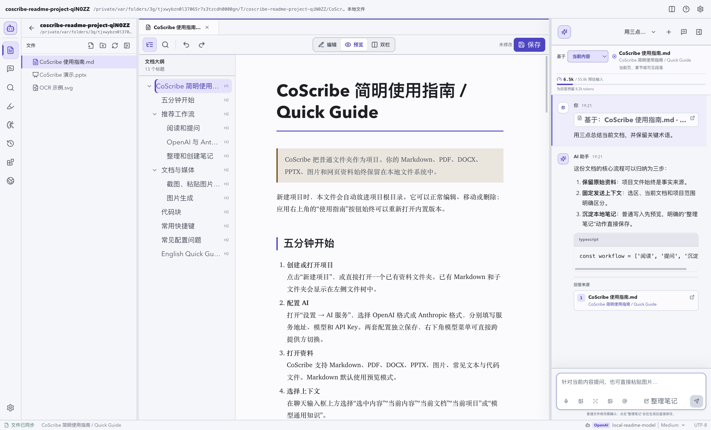
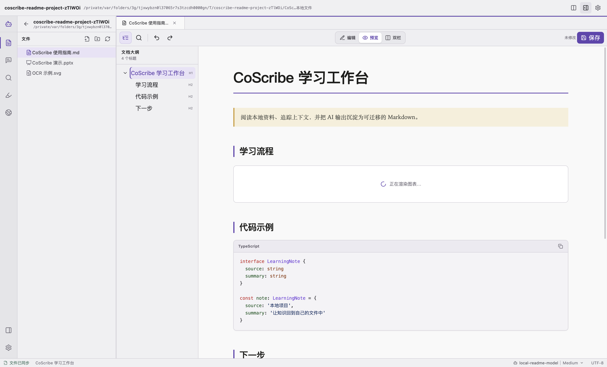
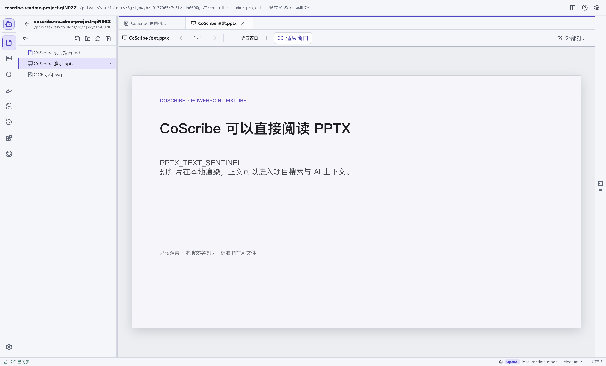
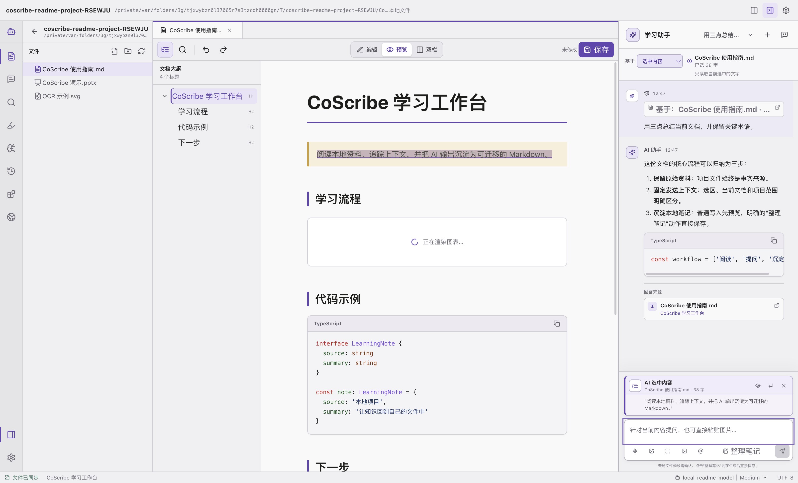
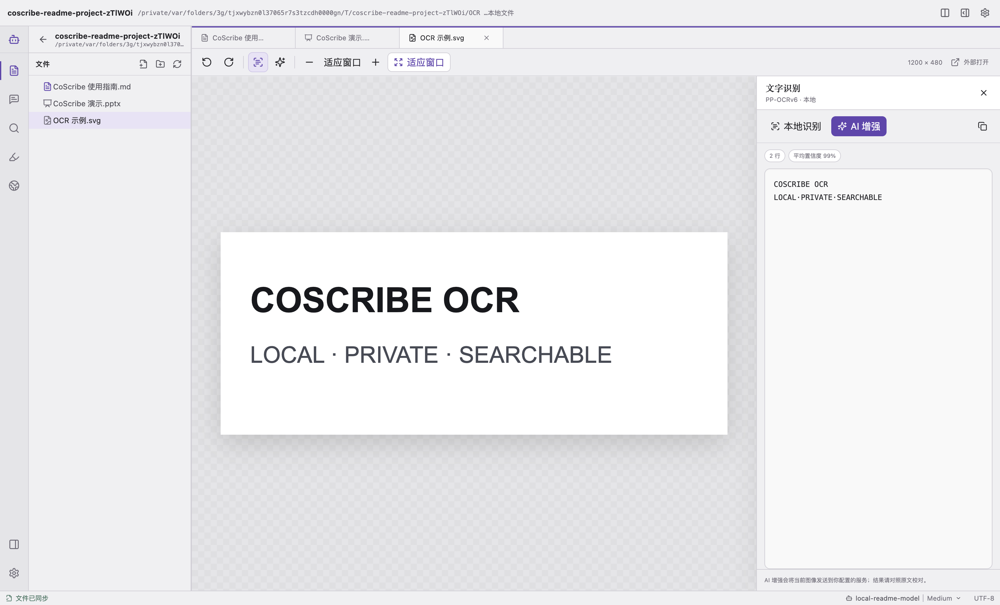
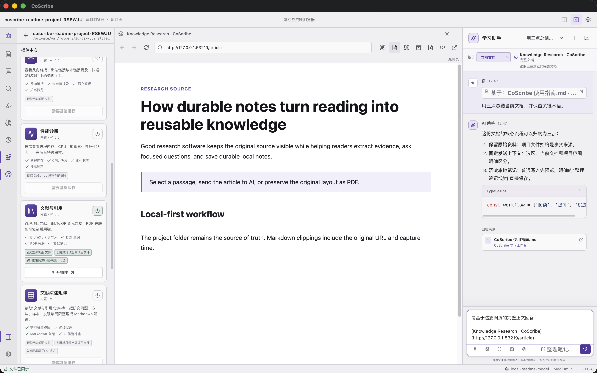
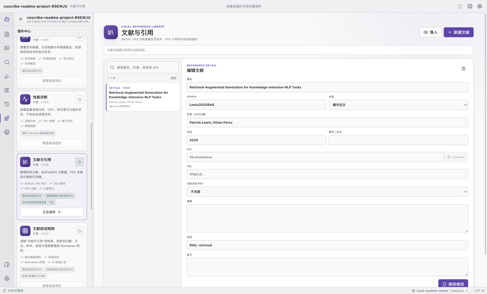

<p align="center">
  
</p>

<h1 align="center">CoScribe</h1>

<p align="center">
  把本地资料、AI 对话与长期笔记放进同一个工作台<br />
  A local-first workspace for reading, AI-assisted research, and durable notes
</p>

<p align="center">
  <a href="#中文">中文</a> ·
  <a href="#english">English</a> ·
  <a href="https://github.com/UESTC-ly/CoScribe/releases/latest">下载 / Download</a> ·
  <a href="./LICENSE">MIT License</a>
</p>



CoScribe 直接把普通文件夹作为项目：阅读 Markdown、PDF、DOCX、PPTX、图片、文本与网页，明确选择交给 AI 的上下文，再把结果保存回标准 Markdown。没有封闭数据库，也不要求迁移已有资料；项目仍可继续用 Obsidian、Typora、VS Code 和文件管理器打开。

CoScribe treats an ordinary folder as the project. Read documents and webpages, choose exactly what AI may use, then save durable results as standard Markdown—without locking the project inside a proprietary database.

---

<a id="中文"></a>

## 中文

### 下载与安装

从 [GitHub Releases](https://github.com/UESTC-ly/CoScribe/releases/latest) 下载稳定版 `v3.1.0`：

| 系统 | 安装包 | 说明 |
| --- | --- | --- |
| macOS | `CoScribe-3.1.0-arm64.dmg` | Apple Silicon，macOS 13+ |
| macOS | `CoScribe-3.1.0-arm64-mac.zip` | Apple Silicon 免安装压缩包 |
| Windows | `CoScribe-Setup-3.1.0-x64.exe` | Windows 10/11 x64 |
| Linux | `CoScribe-3.1.0-x64.AppImage` | 通用 x86-64 便携包 |
| Linux | `CoScribe-3.1.0-x64.deb` | Debian / Ubuntu x86-64 |
| 全平台 | `SHA256SUMS.txt` | 安装包 SHA-256 校验值 |

这些安装包目前没有 Apple Developer ID、Windows Authenticode 或 Linux 发行版签名。

#### macOS

1. 打开 DMG，把 CoScribe 拖入“应用程序”。
2. 首次启动时在 Finder 中右键 CoScribe，选择“打开”。
3. 如果仍被阻止，进入“系统设置 → 隐私与安全性”，点击“仍要打开”。
4. 第一次截图时允许“屏幕录制”；第一次语音输入时允许“麦克风”。

#### Windows

1. 运行 `CoScribe-Setup-3.1.0-x64.exe`。
2. 如果 SmartScreen 拦截未签名安装包，确认文件来自本仓库并核对 SHA-256 后，选择“更多信息 → 仍要运行”。
3. 安装完成后从开始菜单启动 CoScribe。

#### Linux

AppImage：

```bash
chmod +x CoScribe-3.1.0-x64.AppImage
./CoScribe-3.1.0-x64.AppImage
```

Debian / Ubuntu：

```bash
sudo apt install ./CoScribe-3.1.0-x64.deb
```

Wayland 下框选截图是否需要额外授权取决于桌面环境和系统门户配置。

> macOS Apple Silicon 成品已执行真实窗口冒烟测试。Windows 和 Linux 安装包在 macOS 上完成交叉构建、架构与内容静态校验，但尚未在真实 Windows/Linux 主机上安装启动。Windows/Linux 暂不提供本地语音识别和系统日历同步，其余核心工作流均已包含。

### 五分钟开始使用

1. **打开项目**：首页点击“打开文件夹”，选择已有资料目录；也可以创建新项目。
2. **配置 AI**：打开“设置 → AI 服务”，填写兼容 OpenAI 的地址、协议、模型和 API Key。
3. **打开资料**：从文件树打开 Markdown、PDF、DOCX、PPTX、图片或文本。Markdown 默认进入预览。
4. **固定上下文**：选择“当前内容”“选中内容”“当前文档”或“当前项目”，再向 AI 提问。
5. **保存结果**：普通文件修改先检查差异并接受；点击“整理笔记”时，AI 会在项目内选择合适位置或创建新目录和笔记。

新建项目会自动包含 `CoScribe 使用指南.md`。首页和项目右上角也有“使用指南”按钮，即使打开已有文件夹也能随时查看内置版本。指南包含基础配置、上下文选择、截图/OCR、快捷键、Mermaid 与代码块示例。

CoScribe 会识别已有文件与子文件夹，默认排除 `.git`、`.venv`、`node_modules` 等开发目录。

### 配置 AI 服务

打开“设置 → AI 服务”：

| 配置项 | 如何填写 |
| --- | --- |
| 服务地址 | 基础地址，如 `https://api.openai.com/v1`；也支持完整的 `/responses` 或 `/chat/completions` 地址 |
| 接口协议 | 建议选择“自动”；第三方服务不兼容时再固定为 Responses 或 Chat Completions |
| 模型 | 填写服务端真实支持的模型名 |
| API Key | 远程服务必须填写；本机回环服务可不填 |

底部状态栏可快速切换 `gpt-5.6-luna`、`gpt-5.6-terra`、`gpt-5.6-sol`，以及 `low`、`medium`、`high`、`xhigh`、`ultra`、`max` 六档思考强度。第三方站点是否接受这些模型和档位，以其服务端实现为准。

- 远程 AI 地址必须使用 HTTPS；HTTP 只允许 `localhost`、`127.0.0.0/8` 和 `::1`。
- API Key 通过 Electron `safeStorage` 加密保存在系统用户数据目录，不写进项目。
- `Unexpected token '<'` 表示服务返回 HTML 而不是 JSON，请检查最终请求地址、协议和 `/v1` 路径。
- HTTP 401 表示服务端拒绝当前 Key。

图片生成单独在“设置 → 图片生成”配置地址和 API Key。CoScribe 固定调用 `gpt-image-2`，支持 `1024x1024`、`1536x1024`、`1024x1536`，以及 `low`、`medium`、`high` 三档质量。生成结果保存到项目 `assets/ai-images/`，后续对话可以继续引用它的已校验路径。

### 阅读与编辑

| 格式 | 显示与检索 | 编辑能力 |
| --- | --- | --- |
| Markdown (`.md`, `.markdown`) | GFM、数学公式、Mermaid、代码语言识别与高亮、可折叠/调宽大纲 | 编辑、预览、双栏 |
| PDF | 连续页面、缩略图、目录、搜索、选区、OCR | 高亮、批注、书签；不改原 PDF |
| DOCX | 本地解析和净化后的语义预览、全文搜索 | 只读 |
| PPTX | 本地只读幻灯片、逐页文字提取与搜索 | 只读 |
| PPT | 可识别；安装 LibreOffice 后转为同目录 PDF | 只读 |
| 图片 | PNG、JPEG、WebP、GIF、SVG 等查看与缩放 | 本地 OCR / AI 增强 |
| 文本与代码 | TXT、JSON、YAML 和常见源码格式 | 只读搜索 |
| BibTeX / RIS | 文本查看和文献导入 | 可用外部文本编辑器维护 |
| MHTML / MHT | 完整网页归档交给系统浏览器 | 只读 |

<table>
  <tr>
    <td width="50%"></td>
    <td width="50%"></td>
  </tr>
  <tr>
    <td align="center">Markdown、Mermaid、公式与代码高亮</td>
    <td align="center">PPTX 本地只读渲染与逐页搜索</td>
  </tr>
</table>

### 把正确的上下文交给 AI

上下文范围有五档：

- **选中内容**：只发送已经捕获的文字。
- **当前内容**：优先使用实时选区，否则使用当前页、章节或可见段落。
- **当前文档**：使用完整文档；大文件会遵守读取上限。
- **当前项目**：查询本地增量索引，返回带文件、标题、行号或 PDF 页码的相关片段。
- **模型通用知识**：不读取当前项目内容。

在 Markdown、PDF、DOCX、PPTX 或文本中选中文字后，选择“选中内容”，或按 `Cmd/Ctrl + Shift + K`。即使随后点击聊天输入框，原文仍保留独立的 AI 上下文高亮；输入框上方会显示来源文件、字数和摘录，并提供定位、插入输入框和清除操作。发送后，这份冻结选区会保存在用户消息里。



每次发送都会冻结当时的项目、活动分屏、文档、页码或章节、网页 URL、选区和引用文件。发送后切换标签不会改变已经提交的问题。

### 让 AI 整理和创建笔记

- 普通创建、追加或替换 Markdown 会先显示文件列表和差异，接受后才写盘。
- “整理笔记”是明确的自动保存动作：AI 根据会话主题、项目目录和已有笔记选择目标，也可以创建子目录、多份笔记和互链结构；不会默认追加到当前文档。
- 聊天输入框支持 `/compact`（AI 全量压缩并持久化会话摘要）、`/fork`、`/resume`、`/new`、`/clear`、`/note`、`/stop`、`/quit` 和 `/help`。普通的上下文自动压缩仍保留为轻量保护策略；全量压缩不会删除原始聊天。
- “整理笔记”会保存已处理到的会话检查点，后续只整理新增内容；筛选、检索、生成、校验和写入阶段会在聊天窗口中流式显示。
- AI 可以一次创建 1–50 个 Markdown 文件，但不能删除文件、写入项目外路径、跟随符号链接或覆盖二进制资料。
- “AI 操作”保存已接受写入的事务记录。只要文件之后没有被手工修改，就可以安全撤销整次多文件操作。

项目根目录的 `COSCRIBE.md` 是项目级长期记忆。它适合记录稳定目标、术语、偏好、决策和限制，不适合存放 API Key、密码或大段会话原文。左侧“记忆”可以直接审阅和编辑；设置中也可以关闭向模型发送记忆，而不删除文件。

“设置 → 系统提示词”允许编辑回答风格和工作偏好。自定义提示词不能覆盖 CoScribe 固定的路径、密钥和文件确认边界。

### OCR、图片、截图与语音



- 图片点击“本地文字识别”，PDF 点击“本地识别当前页”。内置 PP-OCRv6-small、ONNX Runtime Web 与 WASM 在本机运行，不需要首次下载模型。
- “AI 增强”是单独的显式操作，会把当前图像发送到已配置的 AI 服务。
- 可以直接把 PNG、JPEG、WebP 或非动画 GIF 粘贴进聊天；每条消息最多 4 张，单张最多 5 MB，合计最多 10 MB。
- 点击“截图”或按 `Cmd/Ctrl + Shift + 8`，在冻结的当前显示画面上拖拽选择区域。主窗口不会被隐藏，松开后截图进入聊天附件但不会自动发送，`Esc` 取消。
- macOS Apple Silicon 点击“语音”可在本机实时转写中英文，文字边说边进入输入框。识别器按需启动，停止后退出；原始录音不会发往语音云服务。

OCR 与 AI 输出都可能出错，重要内容需要对照原始资料。

### 资料浏览器



左侧地球图标打开轻量资料浏览器。它复用 Electron 的 Chromium，限制为单标签，不引入第二套浏览器内核。

- 页面保留原始 DOM、样式和交互，不会被纯文本阅读模式替换。
- 可把网页选区、正文或引用来源发送给 AI。
- 可保存完整 MHTML、语义化 Markdown 或保持打印排版的 PDF。
- MHTML 保存当前 HTML、样式和已加载资源，完整文件上限 256 MB，不经过 AI 正文长度限制。
- 视频、复杂下载、直接媒体和弹窗交给系统浏览器。

远程网页运行在独立内存会话中，没有 preload、Node.js、CoScribe IPC、摄像头、麦克风、定位、通知、USB 或文件系统权限。

### 研究工具与内置插件



插件按需加载，首次启用会显示读取项目、写入项目、调用 AI、系统日历或诊断等权限。当前只开放随应用审计的内置插件，不下载或执行远程 JavaScript。

| 插件 | 用途 |
| --- | --- |
| 计划与日程 | 用 Markdown 保存计划，让 AI 生成任务；macOS 可显式同步单个任务到日历/提醒事项 |
| 每日笔记与模板 | 创建日记、周记和项目内模板 |
| 闪卡与间隔复习 | 从 `Q::` / `A::` Markdown 卡片进行本地复习 |
| 双向链接 | 查找 Markdown/Wiki Link、反向链接、未链接提及和孤立笔记 |
| 性能诊断 | 按需查看内存、CPU、索引和插件状态，并可重建索引 |
| 文献与引用 | 导入 BibTeX/RIS、查询 DOI、关联本地 PDF、创建文献笔记 |
| 文献综述矩阵 | 把研究问题、方法、样本、发现、局限与证据位置写回 Markdown |
| MCP 连接器 | 显式发现并调用本地 stdio 或 HTTPS Streamable HTTP 能力 |
| Git 快照 | 创建本地安全检查点，不配置远程、不推送、不混入已有暂存内容 |
| 网页资料跟踪 | 在应用运行期间低频检查网页变化，并保存 Markdown 快照 |

推荐研究流程：导入 `.bib` / `.ris` 或 DOI → 关联本地 PDF → 创建文献笔记 → 填写文献综述矩阵 → 跟踪变化网页 → 用 Git 快照记录研究节点。

MCP 是显式连接边界，不是自动代理权限。每次能力发现和工具、资源或提示词调用都必须在插件页点击执行，调用完成后立即断开。

### 常用快捷键

| 操作 | macOS | Windows / Linux |
| --- | --- | --- |
| 发送选中内容到聊天 | `⌘ ⇧ K` | `Ctrl + Shift + K` |
| 框选截图到聊天 | `⌘ ⇧ 8` | `Ctrl + Shift + 8` |
| 保存 Markdown | `⌘ S` | `Ctrl + S` |
| 查找 | `⌘ F` | `Ctrl + F` |
| 撤销 / 重做 | `⌘ Z` / `⇧ ⌘ Z` | `Ctrl + Z` / `Ctrl + Shift + Z` |
| 发送消息 | `Enter` | `Enter` |
| 换行 | `Shift + Enter` | `Shift + Enter` |
| PPTX 上一页 / 下一页 | `←` / `→` | `←` / `→` |

支持快捷键的按钮会在鼠标悬停时显示对应按键。

### 本地数据与安全

- 项目始终是普通文件夹；`.vibeknowledge/` 只保存工作区状态、会话、批注、OCR 缓存、可重建索引、AI 操作记录、文献元数据和网页跟踪配置。
- 本地索引只重新读取新增或变化的资料；单文件文本上限 4 MB，索引文本总量上限 64 MB。
- 路径守卫拒绝 `..` 越级、项目外绝对路径、符号链接跳转和元数据目录写入。
- Markdown 写入使用临时文件、同步和原子替换，并检查外部修改。
- Electron 渲染器启用 sandbox 与 context isolation，禁用 Node integration。
- DOCX HTML 会先净化；文档、网页和 MCP 返回值都被视为不可信参考资料，而不是系统指令。
- AI、AI OCR 和图片生成只在用户明确操作后，把相应内容发送给已配置服务。

### 从源码运行

需要 Node.js `20.19+` 或 `22.12+`：

```bash
npm install
npm run fetch:asr-model
npm run dev
```

验证：

```bash
npm run typecheck
npm test
npm run test:e2e
npm run build
```

打包：

```bash
npm run dist:mac:arm64
npm run dist:win:x64
npm run dist:linux:x64

npm run verify:package:mac
npm run verify:package:win
npm run verify:package:linux
```

### 当前限制

- 没有云同步、账号、多用户协作、移动端，以及 PDF/DOCX/PPTX 原文编辑。
- 本地实时语音识别和系统日历/提醒事项同步只支持 Apple Silicon macOS。
- Windows/Linux 产物已静态验证，但本次发布没有真实系统运行测试。
- 插件中心尚不能安装第三方插件包。
- 旧版 `.ppt` 依赖用户自行安装 LibreOffice；复杂 PPTX 字体、视频、宏和特殊对象可能与 PowerPoint 有差异。
- 资料浏览器不提供多标签、密码管理、扩展、复杂下载和视频播放。

---

<a id="english"></a>

## English

### Download and install

Download the stable `v3.1.0` release from [GitHub Releases](https://github.com/UESTC-ly/CoScribe/releases/latest):

| Platform | Artifact | Target |
| --- | --- | --- |
| macOS | `CoScribe-3.1.0-arm64.dmg` | Apple Silicon, macOS 13+ |
| macOS | `CoScribe-3.1.0-arm64-mac.zip` | Portable Apple Silicon archive |
| Windows | `CoScribe-Setup-3.1.0-x64.exe` | Windows 10/11 x64 |
| Linux | `CoScribe-3.1.0-x64.AppImage` | Portable x86-64 AppImage |
| Linux | `CoScribe-3.1.0-x64.deb` | Debian / Ubuntu x86-64 |
| All | `SHA256SUMS.txt` | SHA-256 checksums |

The builds are currently unsigned.

- **macOS:** drag CoScribe into Applications, then right-click and choose **Open**. If blocked, use System Settings → Privacy & Security → Open Anyway. Screen Recording is used only for region capture; Microphone is used only for local speech input.
- **Windows:** run the x64 installer. If SmartScreen appears, verify the checksum and source before choosing **More info → Run anyway**.
- **Linux AppImage:** run `chmod +x CoScribe-3.1.0-x64.AppImage`, then `./CoScribe-3.1.0-x64.AppImage`.
- **Debian/Ubuntu:** run `sudo apt install ./CoScribe-3.1.0-x64.deb`.

> The Apple Silicon macOS package passed real-window smoke tests. Windows and Linux were cross-built on macOS and passed architecture and packaged-content verification, but were not installed or launched on physical Windows/Linux hosts. Local speech recognition and system Calendar integration remain macOS-only.

### Start in five minutes

1. **Open a project:** select an existing folder or create a new one.
2. **Configure AI:** enter an OpenAI-compatible endpoint, protocol, model, and API key under Settings → AI service.
3. **Read a source:** open Markdown, PDF, DOCX, PPTX, an image, or text. Markdown opens in Preview by default.
4. **Freeze the scope:** choose Current content, Selection, Current document, or Project before sending.
5. **Save durable results:** review ordinary file proposals before accepting them; use Quick Note when AI should route and save notes inside the project.

Every new project includes an editable `CoScribe 使用指南.md`. The **User Guide** button on both the home screen and project title bar always opens the built-in copy, including setup, context, screenshot/OCR, shortcut, Mermaid, and code-block examples.

Existing files and nested folders appear directly. `.git`, `.venv`, `node_modules`, and similar development directories are excluded from the research tree.

### Configure AI and image generation

Settings → AI service accepts either a base URL such as `https://api.openai.com/v1` or a full `/responses` or `/chat/completions` endpoint. Automatic protocol mode is recommended. Remote services require HTTPS and an API key; loopback services may use HTTP without a key.

The status bar switches among `gpt-5.6-luna`, `gpt-5.6-terra`, and `gpt-5.6-sol`, with `low`, `medium`, `high`, `xhigh`, `ultra`, and `max` reasoning levels. A third-party provider must actually support the chosen values. Keys are encrypted with Electron `safeStorage` outside the project.

`Unexpected token '<'` means the server returned HTML rather than JSON. Check the final request URL, protocol, proxy route, and `/v1` path. HTTP 401 means the provider rejected the key.

Image generation has a separate endpoint and key. CoScribe calls `gpt-image-2` with three sizes and `low`, `medium`, or `high` quality, then saves output under `assets/ai-images/` with verified paths available to later chat turns.

### Documents and reading

| Format | Viewer and retrieval | Editing |
| --- | --- | --- |
| Markdown | GFM, math, Mermaid, language-aware code highlighting, resizable/collapsible outline | Edit, Preview, Split |
| PDF | Continuous pages, thumbnails, outline, search, selection, OCR | Highlights, comments, bookmarks; source PDF unchanged |
| DOCX | Locally parsed and sanitized semantic preview | Read-only |
| PPTX | Local slide rendering and per-slide text search | Read-only |
| PPT | Convert to PDF with a separate LibreOffice installation | Read-only |
| Images | PNG, JPEG, WebP, GIF, SVG, and more | Local OCR / AI Enhance |
| Text and source files | TXT, JSON, YAML, and common source formats | Read-only search |
| BibTeX / RIS | Text viewer and reference import | Maintain with an external text editor |
| MHTML / MHT | Complete archive opened by the system browser | Read-only |

<table>
  <tr>
    <td width="50%"></td>
    <td width="50%"></td>
  </tr>
  <tr>
    <td align="center">Markdown, Mermaid, math, and highlighted code</td>
    <td align="center">Local read-only PPTX rendering and search</td>
  </tr>
</table>

### Give AI the right context

The five scopes are Selection, Current content, Current document, Project, and General knowledge. Project scope queries a local incremental index and preserves source paths, headings or lines, and PDF page numbers.

Select text in Markdown, PDF, DOCX, PPTX, or text and choose Selection, or press `Cmd/Ctrl + Shift + K`. The source keeps a dedicated AI-context highlight after focus moves to the composer. A compact card shows the document, character count, and excerpt, with Locate, Insert, and Clear actions. Sending moves the frozen selection into the user message.


Every sent turn freezes its project, pane, document, page or heading, webpage URL, selection, and referenced files. Switching tabs afterward cannot silently change the question's context.

### AI writing, project memory, and system prompts

- Ordinary create, append, and replace operations show a file list and diff before writing.
- Quick Note is the explicit automatic-save action. AI uses the conversation topic, project tree, and existing notes to choose a destination or create directories and linked notes; it does not default to the open document.
- AI may create 1–50 Markdown files but cannot delete files, escape the project, follow symlinks, or overwrite binary sources.
- Accepted transactions appear under AI Operations and can be undone if no later manual edit would be overwritten.

`COSCRIBE.md` is transparent project-level memory for durable goals, terminology, preferences, decisions, and constraints. It is ordinary Markdown and never crosses project boundaries. Do not store secrets or raw conversation dumps there.

Settings → System prompt provides editable response and workflow instructions. These instructions remain below CoScribe's immutable path, secret, and confirmation boundaries.

### OCR, images, screenshots, and speech


- Local OCR uses bundled PP-OCRv6-small, ONNX Runtime Web, and WASM with no first-run model download.
- AI Enhance is a separate opt-in action that sends only the current image or rendered PDF page to the configured AI service.
- Paste or choose up to four PNG, JPEG, WebP, or non-animated GIF images per message; each is limited to 5 MB and the total to 10 MB.
- `Cmd/Ctrl + Shift + 8` freezes the visible display—including the open note—without hiding CoScribe. Drag a region to attach the crop without sending it; `Esc` cancels.
- On Apple Silicon macOS, Voice performs live bilingual transcription locally. Text appears in the composer while speaking, and the on-demand recognizer exits after recording.

Always verify OCR and AI output against the primary source.

### Research browser


The globe icon opens a single-tab research browser backed by Electron's existing Chromium. It keeps the original DOM, styling, and interaction visible. Send a selection, extracted article text, or a citation to AI; save the page as complete MHTML, semantic Markdown, or print-layout PDF.

MHTML preserves the currently loaded HTML, styles, and resources as one all-or-nothing file up to 256 MB without passing through the AI text limit. Video, complex downloads, direct media, and popups go to the system browser.

Remote pages use an isolated in-memory session with no preload, Node.js, CoScribe IPC, camera, microphone, geolocation, notifications, USB, or filesystem access.

### Built-in research plugins


Audited built-ins are lazy-loaded and disclose their permissions before activation:

- Planner and optional per-task macOS Calendar/Reminders sync
- Daily Notes and project-local templates
- Flashcards and local spaced review
- Backlinks, wiki links, unlinked mentions, and orphan notes
- On-demand performance diagnostics
- BibTeX/RIS/DOI reference management and local PDF links
- A Markdown literature-review matrix with explicit evidence locations
- Explicit local stdio or HTTPS Streamable HTTP MCP calls
- Safe local Git snapshots without remote configuration or pushes
- Low-frequency webpage change tracking while CoScribe is running

A practical research flow is: import references → link local PDFs → create literature notes → maintain the evidence matrix → track changing sources → record milestones with Git snapshots.

MCP is an explicit connection boundary, not ambient agent authority. Discovery and every tool, resource, or prompt invocation require a click in the plugin view, and the connection closes afterward.

### Keyboard shortcuts

| Action | macOS | Windows / Linux |
| --- | --- | --- |
| Send selection to chat | `⌘ ⇧ K` | `Ctrl + Shift + K` |
| Capture a region to chat | `⌘ ⇧ 8` | `Ctrl + Shift + 8` |
| Save Markdown | `⌘ S` | `Ctrl + S` |
| Find | `⌘ F` | `Ctrl + F` |
| Undo / Redo | `⌘ Z` / `⇧ ⌘ Z` | `Ctrl + Z` / `Ctrl + Shift + Z` |
| Send / newline | `Enter` / `Shift + Enter` | `Enter` / `Shift + Enter` |
| Previous / next PPTX slide | `←` / `→` | `←` / `→` |

Hovering a button backed by a keyboard action shows its shortcut.

### Local data and security

- Projects remain ordinary folders. `.vibeknowledge/` stores workspace state, sessions, annotations, OCR metadata, the rebuildable index, AI operation history, references, and web-tracking configuration.
- The incremental index re-reads only changed sources, limits individual text sources to 4 MB, and caps aggregate indexed text at 64 MB.
- Path guards reject traversal, outside absolute paths, symlink escapes, and metadata writes.
- Markdown writes use temporary files, synchronization, atomic replacement, and external-modification checks.
- The renderer uses Electron sandboxing and context isolation with Node integration disabled.
- DOCX HTML is sanitized. Documents, webpages, and MCP results remain untrusted reference material rather than system instructions.
- AI, AI OCR, and image-generation requests leave the machine only after an explicit user action.

### Build from source

Use Node.js `20.19+` or `22.12+`:

```bash
npm install
npm run fetch:asr-model
npm run dev

npm run typecheck
npm test
npm run test:e2e
npm run build
```

Package and inspect all release targets:

```bash
npm run dist:mac:arm64
npm run dist:win:x64
npm run dist:linux:x64

npm run verify:package:mac
npm run verify:package:win
npm run verify:package:linux
```

### Current limits

CoScribe does not provide cloud sync, accounts, multi-user collaboration, mobile clients, or source editing for PDF/DOCX/PPTX. Local live speech and system Calendar/Reminders integration are Apple Silicon macOS-only. Windows and Linux packages are statically verified but were not runtime-tested on native hosts for this release. The plugin center accepts audited built-ins only. Legacy PPT conversion requires a separate LibreOffice installation. The research browser intentionally omits tabs, passwords, extensions, advanced downloads, and video playback.

## License

[MIT](./LICENSE)
