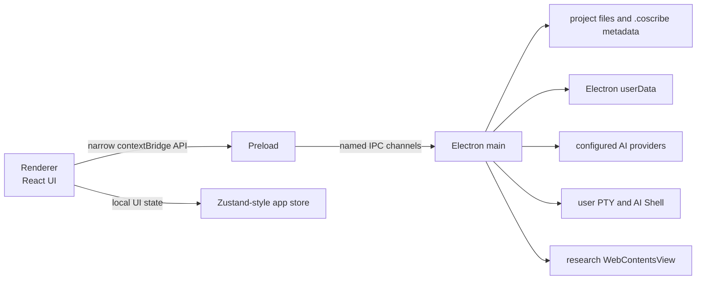
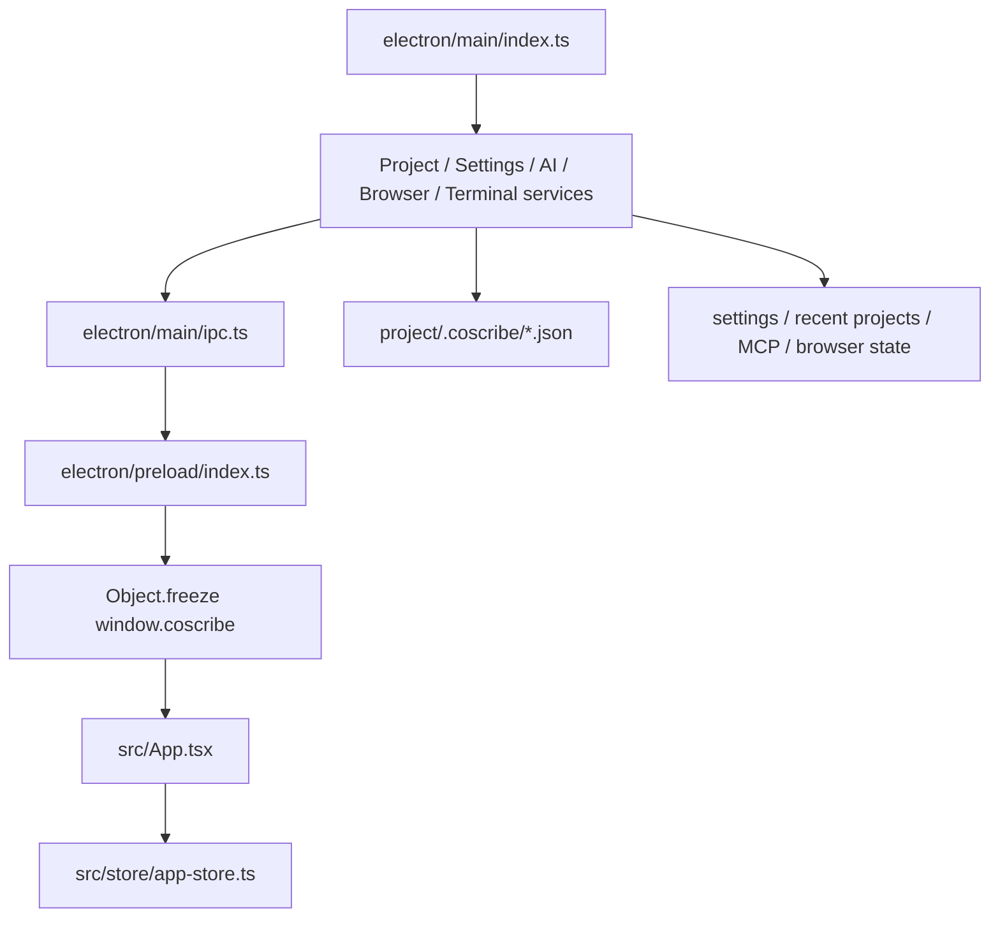
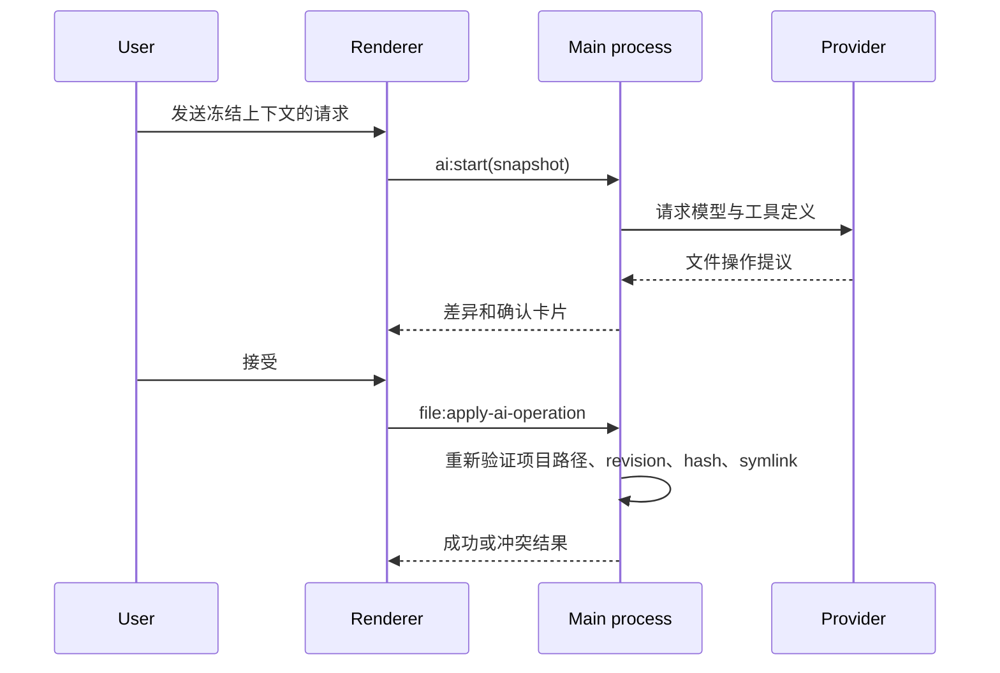
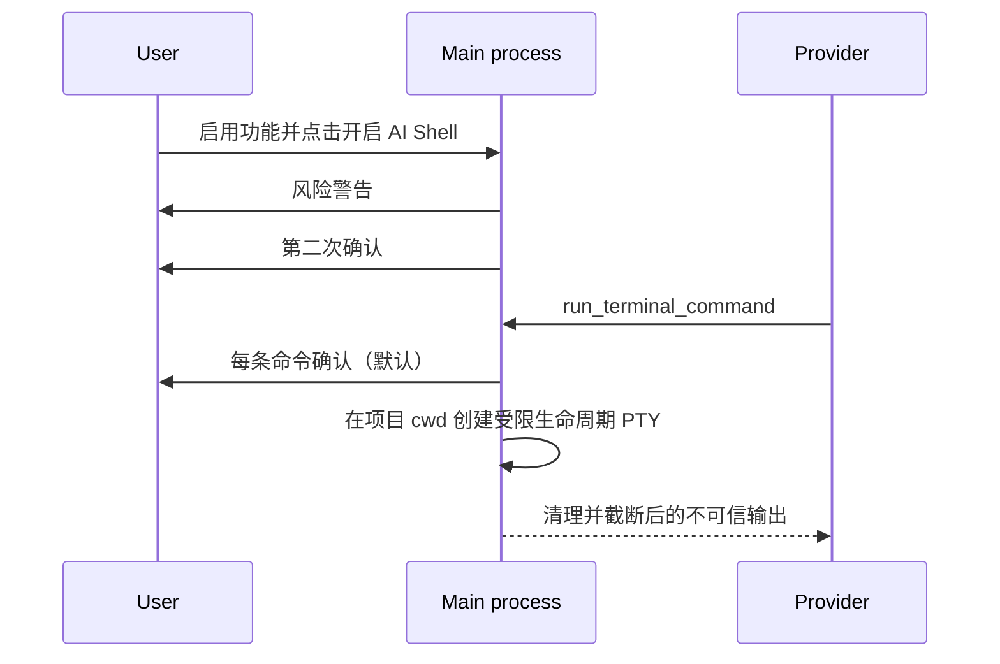

# 系统架构

> 事实源：`electron/main/index.ts`、`electron/main/ipc.ts`、`electron/preload/index.ts`、`src/shared/types.ts`、`src/App.tsx`；核对日期 2026-07-31。

## 总览

CoScribe 是 Electron、React 和 TypeScript 应用。架构核心是把不可信 UI 与高权限系统能力分离：

Renderer 没有 Node.js、文件系统或子进程访问能力。所有磁盘、网络、系统对话框、浏览器、OCR 持久化、终端和 AI Provider 请求都通过主进程处理。

主窗口在 `electron/main/index.ts` 中显式启用 `contextIsolation`、`sandbox` 和 `webSecurity`，并关闭 `nodeIntegration`。资料浏览器不是 Renderer DOM iframe，而是 main 管理的隔离 `WebContentsView`；它使用 `persist:coscribe-research-browser` 分区保存站点状态。

## 主要目录

| 目录 | 职责 |
| --- | --- |
| `src/` | Renderer 应用、React 组件、状态、上下文、共享类型和内置插件 UI |
| `src/components/` | AI、文件树、阅读器、IDE、设置、终端等用户界面 |
| `src/lib/` | 上下文快照、聊天会话、文件操作、OCR、剪贴板等纯逻辑 |
| `src/shared/` | Renderer/main 共用的严格 TypeScript 契约 |
| `electron/main/` | 项目文件、AI、终端、设置、搜索、浏览器、MCP、OCR 等高权限服务 |
| `electron/preload/` | 受限 `contextBridge` API |
| `electron/ipc-channels.ts` | IPC 通道常量的唯一来源 |
| `tests/` | 单元、主进程、AI 和 Playwright 桌面测试 |
| `resources/` | 内置指南、OCR 模型、许可证和打包资源 |

## 服务装配与数据流

`electron/ipc-channels.ts` 是通道名的唯一清单，`src/shared/types.ts` 是请求、返回值与事件类型的唯一编译期契约。新增跨进程能力必须同时核对这四层，不能只改 Renderer。

## 信任边界

### 项目文件

主进程把当前打开的项目根目录视为文件操作边界。读写、重命名、移动、删除、导入和 AI 应用操作均重新验证路径、项目根、符号链接和预期版本；写入使用原子方式完成。

### AI 上下文与写操作

AI 请求在发送时创建不可变 `ContextSnapshot`，其中包含项目、活动文档、页码/章节、选区、显式引用文件和当前代码未保存缓冲区。AI 的文件操作是“提议 → 差异预览 → 用户确认 → 主进程再校验 → 写入”的链路，不是 Renderer 或模型直接写盘。

### IDE 补全

代码编辑器使用 CodeMirror 的本地候选源提供当前文件中的关键字、声明和变量。该路径只读取 Renderer 内的当前文档，不经过 preload、IPC、主进程或 AI Provider。模型驱动的自动代码补全及其设置和 IPC 已移除。

### 终端

用户 PTY 和 AI Shell 是两个不同的主进程会话。AI Shell 只有在设置启用、当前项目完成两次确认、且命令审批通过后才可执行；输出经过长度与控制字符处理，并作为不可信资料交回模型。

## 关键运行流

### AI 文件修改

### AI Shell

## 扩展原则

- 共享请求/响应类型先放入 `src/shared/types.ts`。
- 新权限能力先在主进程实现，再通过 `electron/ipc-channels.ts` 和 `electron/preload/index.ts` 暴露最小方法集。
- 不向 Renderer 暴露泛化 IPC、文件系统、`child_process` 或终端对象。
- 影响文件、凭据、网络、MCP、浏览器或终端的改动必须补充主进程测试；影响交互路径时再补充 Playwright 场景。
