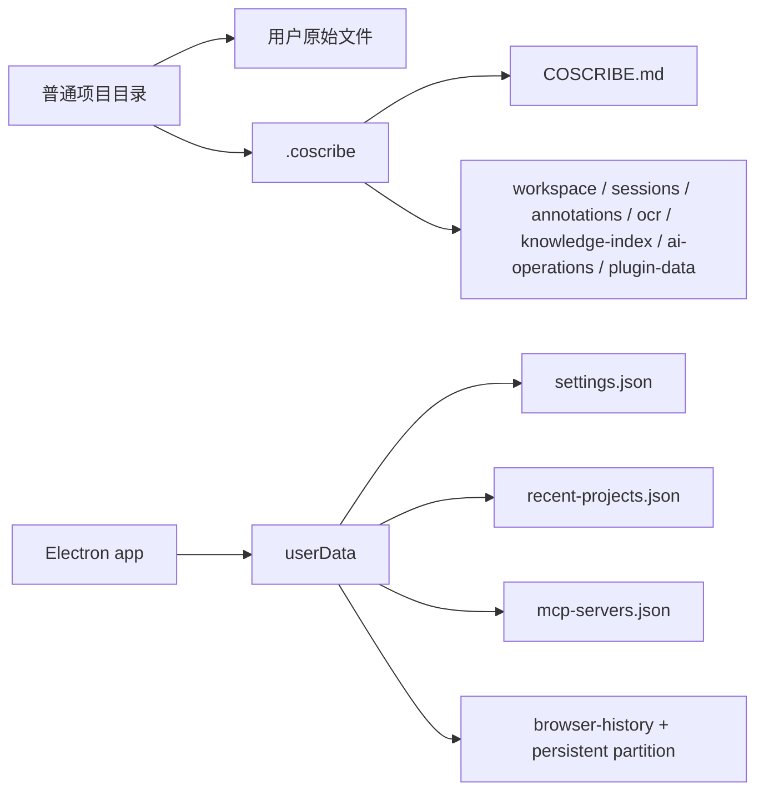

# 数据与存储

> 事实源：`electron/main/project.ts`、`electron/main/project-memory.ts`、`electron/main/storage.ts`、`electron/main/settings.ts`、`electron/main/mcp.ts` 和 `electron/main/browser.ts`；核对日期 2026-07-31。当前实现没有 SQLite、ORM 或服务端数据库。

## 设计原则

用户资料首先是普通文件。CoScribe 读取和写入项目中的 Markdown、代码、文本及用户明确选择的内容，不要求导入专有数据库。

项目内记忆和应用元数据统一存放在隐藏目录 `.coscribe/`。首次打开旧项目时，应用会把 `.vibeknowledge/` 和根目录 `COSCRIBE.md` 中可兼容的数据复制到该目录；旧来源不会被删除或改名，因此仅打开项目不会造成 Git 已跟踪文件消失。新位置已存在同名文件时以新位置为准。

## 项目内数据

| 位置 | 用途 | 说明 |
| --- | --- | --- |
| 用户文件夹及原始资料 | 用户的 Markdown、代码、PDF、DOCX、PPTX、图片等 | 主数据，仍可被其他软件使用 |
| `.coscribe/COSCRIBE.md` | 项目级长期记忆 | 保存稳定目标、术语、偏好和决策；不要存密钥 |
| `.coscribe/` | CoScribe 内部数据 | 记忆、工作区、会话、批注、OCR、AI 操作等 |
| `assets/ai-images/` | 经确认写入项目的生成图片 | 由主进程保存并校验路径 |

`.coscribe` 中由 `ProjectService` 管理的 JSON 基名只有 `workspace`、`sessions`、`annotations`、`ocr`、`knowledge-index`、`ai-operations` 和 `plugin-data`。项目记忆是单独的 Markdown 文件，不属于这些 JSON。

项目文件树默认不把 `.coscribe`、兼容期旧目录 `.vibeknowledge`、`.git`、`node_modules`、`.venv` 等目录作为普通资料展示。

## 用户级数据

Electron `userData` 用于保存：

| 文件/区域 | 内容 |
| --- | --- |
| `settings.json` | 非机密设置和加密密钥的引用/密文 |
| `recent-projects.json` | 最近项目记录 |
| `mcp-servers.json` | 加密的 MCP 配置 |
| `browser-history.json` | 资料浏览器历史 |
| 浏览器持久分区 | 资料浏览器 Cookie/localStorage 等登录态 |

具体目录由操作系统和 Electron 解析。当前应用为了兼容历史配置使用 `vibeknowledge` userData 名称。

## 一致性与恢复

JSON 写入使用临时文件、同步和原子重命名。读取损坏或不存在的 JSON 时，相关服务会尽量回退到安全默认值而不阻止用户继续打开项目。

AI 文件操作保留 before/after 内容以支持撤销，因此 `ai-operations.json` 可能包含敏感正文。备份、同步、问题报告和人工共享前应审查 `.coscribe/` 内容。

## 备份建议

1. 优先备份项目原始文件和 Markdown。
2. 需要恢复记忆、会话、批注、OCR 或工作区布局时，再同时备份 `.coscribe/`。
3. 需要迁移 AI 服务配置时，依赖目标系统的 `safeStorage` 可用性；不要复制明文 API Key 到项目。
4. 资料浏览器的登录态可能敏感，默认不应纳入共享归档。

## Git 与隐私

项目可以是 Git 仓库，但本地 Git 快照不是云备份，也不会自动推送远程。内置 Git 快照会排除 `.coscribe` 和旧 `.vibeknowledge`；使用外部 Git 时，是否跟踪这些内部数据应由项目维护者在 `.gitignore` 中明确决定。

本仓库自身的 `/learn/` 是私有本地资料，根 `.gitignore` 已排除。不得用 `git add -f` 将其加入源码、tag、Release 或公开制品。
