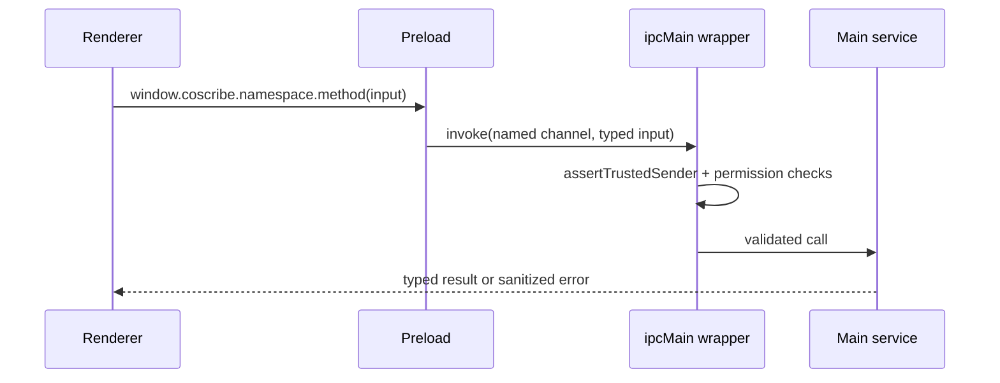

# 桌面 API 与 IPC 契约

> 事实源：`electron/preload/index.ts`、`src/shared/types.ts`、`electron/ipc-channels.ts`、`electron/main/ipc.ts`；核对日期 2026-07-31。

## 适用范围

Renderer 不直接使用 Electron API。它只能访问 preload 通过 `contextBridge` 暴露的只读 `window.coscribe` 对象。完整的可编译契约以以下文件为准：

- `src/shared/types.ts`：参数、返回值、事件和数据模型。
- `electron/ipc-channels.ts`：通道名称。
- `electron/preload/index.ts`：Renderer 可调用的实际方法。
- `electron/main/ipc.ts`：主进程 handler 与授权入口。

本文是面向开发者的分类索引，不能替代类型检查。



## API 分类

| 命名空间 | 主要能力 |
| --- | --- |
| `app`、`clipboard` | 平台、版本和受控剪贴板写入 |
| `project` | 最近项目、创建/打开/关闭、文件树、工作区状态、项目记忆、操作历史 |
| `file` | 读取、受保护的文本保存/创建、文件夹、重命名、移动、回收站、导入、外部打开、AI 操作应用 |
| `sessions`、`annotations` | 会话与批注持久化 |
| `search`、`knowledge` | 项目检索、进度事件、索引状态、重建、反向链接 |
| `plugins`、`calendar`、`diagnostics` | 内置插件数据及其显式能力 |
| `references`、`mcp`、`gitSnapshots`、`webTracker` | DOI、MCP、Git 快照、网页跟踪 |
| `pdf`、`ocr`、`screenshot`、`speech` | 本地文档与媒体能力 |
| `browser` | 隔离资料浏览器的标签、导航、提取、保存和事件 |
| `images` | 显式图片生成和停止 |
| `settings` | 获取和保存经过主进程归一化的设置 |
| `ai` | 模型发现、流式对话和停止 |
| `terminal` | 用户 PTY、外部终端、AI Shell 授权状态与事件 |

## 文件 API

`file` 写入相关方法都只接受当前项目内的目标，并由主进程处理：

```text
read(path)
saveMarkdown(path, content, expectedModifiedAt?)
saveText(path, content, expectedModifiedAt?)
createMarkdown(path, content?)
createText(path, content?)
createFolder(path)
rename(path, nextName)
move(path, targetFolder)
trash(path)
importFiles(sourcePaths, targetFolder)
reveal(path)
openExternal(path)
url(path)
convertPowerPointToPdf(path)
pathForDroppedFile(file)
applyAiOperation(proposal)
```

调用成功不代表 Renderer 获得文件系统权限。实际逻辑会重新验证路径、文件身份、项目边界和写入前版本。

`pathForDroppedFile(file)` 是唯一不走 IPC 的文件辅助方法；preload 使用 Electron `webUtils.getPathForFile` 取得用户实际拖入文件的路径。它只解析路径，不执行读取或写入，后续 `importFiles` 仍由 main 校验。

## AI API

```text
listModels(request) -> AiModelListResult
start(request) -> void
stop(requestId) -> void
onStream(listener) -> unsubscribe
```

`ai.start` 的输出走 `onStream`，事件包括 `start`、`activity`、`context-usage`、`progress`、`delta`、`done`、`stopped` 和 `error`。

编辑器的本地关键字和当前文件符号候选不属于桌面 API；它们完全在 Renderer 中生成。右侧 AI 创建或修改代码文件仍通过 `ai.start` 返回文件操作提议，再由 `file.applyAiOperation` 在用户确认后执行。

## 终端 API

```text
create({ cwd?, cols?, rows? }) -> TerminalSessionInfo
write(sessionId, data) -> void
resize(sessionId, cols, rows) -> void
kill(sessionId) -> void
openExternal(cwd?) -> void
authorizeAiShell() -> AiShellStatus
revokeAiShell() -> AiShellStatus
aiShellStatus() -> AiShellStatus
onEvent(listener) -> unsubscribe
```

普通 PTY 会话归创建它的 Renderer 窗口所有。`write`、`resize` 和 `kill` 会验证会话归属。AI Shell 不通过 `create` 暴露；它只由主进程中的 AI 工具在授权链完整时执行。

## 事件订阅

preload 统一以 `subscribe` 包装 `ipcRenderer.on`，每一个 `onXxx` 都返回取消订阅函数。组件卸载时必须调用该函数，并清理自己创建的终端、浏览器或异步请求。

例外是高频语音 PCM：`speech.audio` 使用 `ipcRenderer.send`，主进程仍对 sender 和参数做检查；它不是任意消息通道。

## 新增 IPC 的最低要求

1. 定义共享类型和输入上限。
2. 添加命名 IPC 常量。
3. 主进程 handler 验证 sender、权限、项目路径和业务输入。
4. preload 仅暴露所需的具体方法。
5. 主进程测试覆盖拒绝路径和错误输入。
6. UI 场景新增可观察的成功与失败测试。
