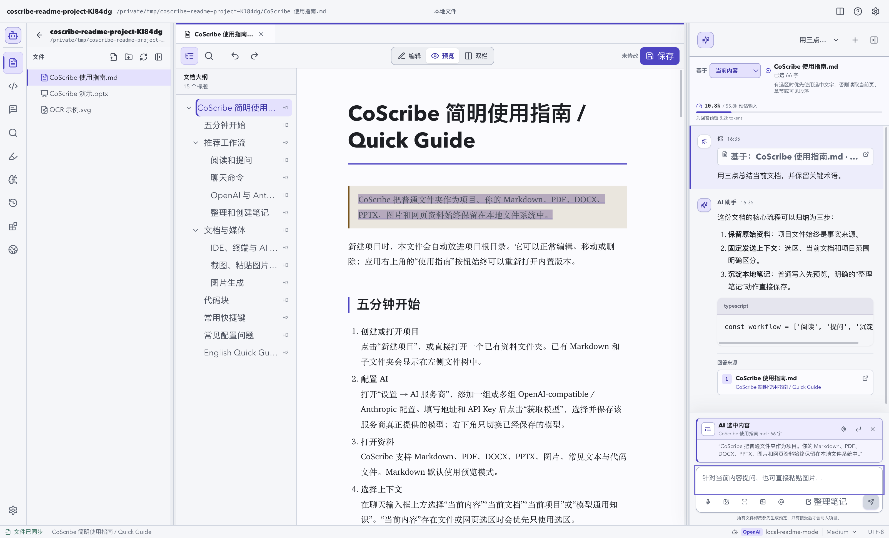
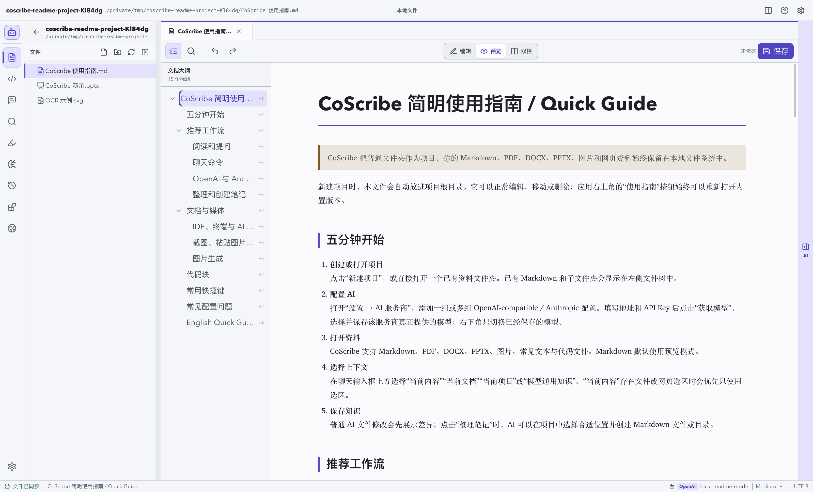
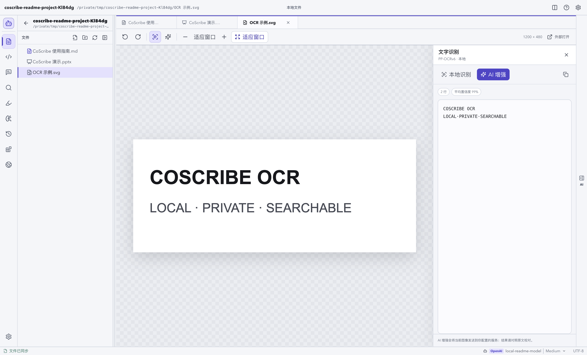
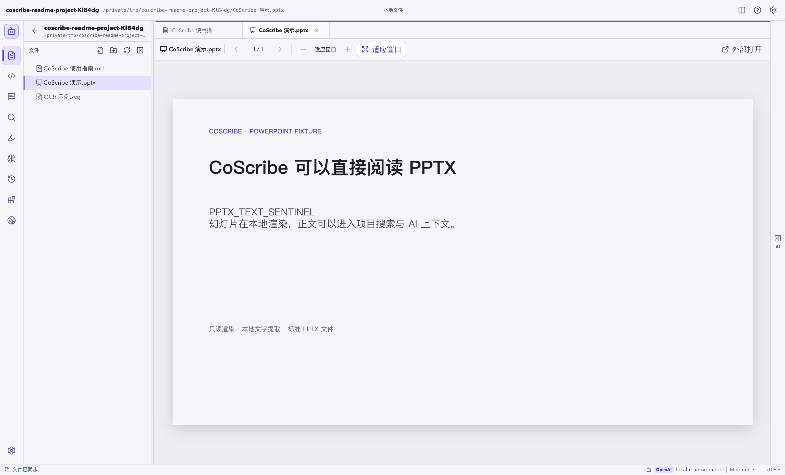
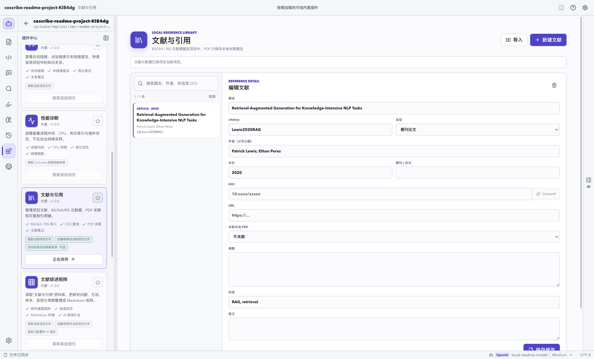
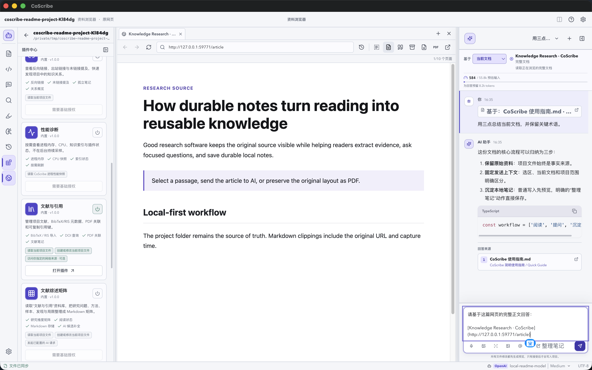

# 产品需求与工作流

> 事实源：`README.md`、`DESIGN.md`、`src/App.tsx`、`src/components/`、`src/plugins/registry.ts` 与对应测试；核对日期 2026-07-31。没有代码或测试证据的商业指标不在本文声明。

## 产品定位

CoScribe 面向学生、研究者、技术阅读者和本地内容工作者。它把资料阅读、项目文件、AI 对话和可持续维护的 Markdown 笔记组织在同一个桌面工作区中，但不要求把资料迁移到专有数据库。

普通文件夹就是项目。原始文件仍可用文件管理器、编辑器或其他工具打开；CoScribe 只在项目内写入必要的本地元数据和经用户确认的内容。

## 需求边界

| 目标 | 当前实现 | 验收观察点 |
| --- | --- | --- |
| 保留资料所有权 | 原文件保持普通文件；内部状态进入 `.coscribe/` | 离开 CoScribe 后原文件仍可读取 |
| 控制 AI 上下文 | 当前内容、当前文档、当前项目、通用知识与显式引用 | 每条请求保存发送时 `ContextSnapshot` |
| 防止模型直接写盘 | 模型只返回文件操作提议 | 用户先看到差异，主进程重验后才写入 |
| 支持持续研究 | 会话、批注、索引、项目记忆与内置插件 | 关闭并重开项目后所需状态可恢复 |
| 提供本地开发面 | IDE、CodeMirror 本地候选、用户 PTY、可选 AI Shell | 代码保存和命令执行具有显式状态与授权 |

## 核心工作流

1. 打开或创建项目文件夹。
2. 在文件树阅读 Markdown、PDF、DOCX、PPTX、图片、文本或网页资料。
3. 选择“当前内容、当前文档、当前项目、模型通用知识”等上下文范围；“当前内容”会优先使用已经捕获的文件或网页选区。流式回答期间仍可调整范围，但只影响下一次发送，不能改写已经冻结的请求上下文。
4. 向已配置的 AI 服务提问，查看来源、活动和上下文使用情况。
5. 预览 AI 提议的文件改动，确认后再写入项目；需要时可撤销仍未被手工修改的已接受操作。
6. 使用项目隐藏文件 `.coscribe/COSCRIBE.md` 保存稳定目标、术语、偏好和决策。

## IDE 工作区

左侧活动栏的 **IDE** 只切换中央工作区，右侧 AI 侧栏、当前会话和模型配置不会被关闭。

- 代码文件单击选择，双击打开。
- 编辑器支持跟随明暗主题的语法高亮、高对比度光标、`Cmd/Ctrl+S` 保存和独立的代码自动保存开关/间隔。代码自动保存关闭时，输入只保留在缓冲区，直到用户明确保存。
- 编辑器只在 Renderer 本地提供关键字和当前文件声明候选；`Tab` 可接受已打开的本地候选。输入、换行或移动光标不会触发模型请求，也没有内联 AI 建议入口。
- AI 上下文会识别当前代码文件、选区和未保存缓冲区。请求发送时会冻结这份上下文，随后切换标签页不会改变已提交请求。
- 普通 AI 对话可以提议创建或修改受支持的代码/文本文件，但写盘前仍需要显示差异并由用户确认。

## 终端与 AI Shell

底部内置终端是用户直接操作的独立 PTY，工作目录为当前项目。工具栏还可以把当前项目路径交给系统已安装的终端软件。

**AI Shell 不等于普通终端，也不等于设置中的开关。**

1. “设置 → AI 行为 → 启用 AI Shell 功能”只让 IDE 终端显示“开启 AI Shell”入口。
2. 它不会授予 AI 权限，也不会执行命令。
3. 用户在终端点击“开启 AI Shell”后，必须先阅读风险警告，再进行第二次原生确认。
4. 默认每一条 AI 提议的命令还需要再次确认；可以改为当前项目会话内授权。
5. 授权仅驻留内存、只绑定当前项目，关闭终端、关闭项目、关闭应用或设置关闭功能时都会撤销。

AI Shell 命令使用当前登录用户权限运行，不是文件系统沙箱。因此它适用于用户明确理解并愿意审批的开发任务，不能用于无人值守或高风险自动化。

## 资料与平台能力

| 类型 | 当前工作流 |
| --- | --- |
| Markdown | 阅读、编辑、双栏查看、大纲、Mermaid、数学公式和代码块 |
| PDF | 阅读、搜索、选区、批注、书签、当前页 OCR |
| DOCX / PPTX | 本地预览和全文搜索；不编辑源文件 |
| 图片 | 浏览、本地 OCR、显式 AI 增强 |
| 网页 | 内置资料浏览器、标签、选区、存档为 Markdown/PDF/MHTML |
| 代码 | IDE 编辑、保存、本地符号提示、受确认的 AI 文件操作 |

本地语音输入和系统日历目前仅在 Apple Silicon macOS 提供。Windows/Linux 的实际可用插件以运行时 UI 和 `src/plugins/registry.ts` 为准。

### 实际界面示例

| 场景 | 截图 |
| --- | --- |
| Markdown、Mermaid 与代码块 |  |
| 本地 OCR |  |
| PPTX 只读渲染 |  |
| 文献与引用插件 |  |
| 隔离资料浏览器 |  |

## 非目标

当前版本不提供云账户、多用户协同、移动端、第三方插件市场、浏览器扩展、浏览器密码管理、自动更新，或让 AI 静默删除文件和静默执行本机命令。
