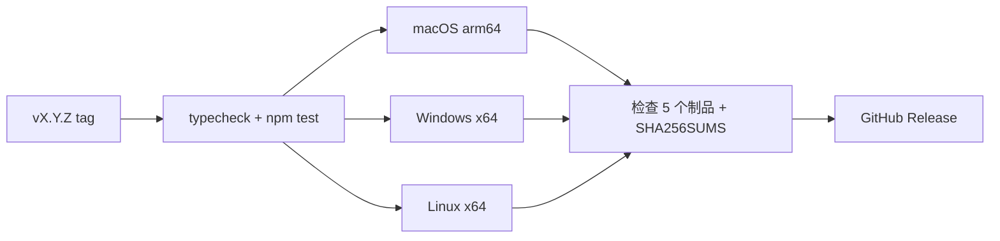

# 测试、打包与部署

> 事实源：`package.json`、三套 Vitest 配置、`playwright.config.ts`、`tests/e2e/`、三平台校验脚本和 `.github/workflows/`；核对日期 2026-07-31。

## 当前本地证据

在当前工作树实际运行：

| 命令 | 结果 |
| --- | --- |
| `npm run typecheck` | 通过：Renderer 与 Node/Electron 两套 TypeScript 检查 |
| `npm test` | 通过：29 文件/111 unit，23 文件/162 Electron，2 文件/36 AI；合计 309 项 |
| `npm run build` | 通过：main、preload、renderer 均产出；Vite 报告 OpenCV 的 `fs/path/crypto` 浏览器外部化警告 |
| `npm run test:e2e` | 通过：40 项；2 项按条件跳过（未提供成品可执行文件、未提供 ASR WAV 夹具） |
| `node scripts/capture-readme-images.mjs` | 通过：临时项目、临时 userData、本地 mock Provider，刷新 7 张截图 |

上述证据不包含当前工作树的成品包 smoke、真实第三方 Provider、签名/公证或三平台安装体验。

## 本地验证层级

| 改动类型 | 最低验证 |
| --- | --- |
| 文档或纯类型 | `npm run typecheck`、链接/路径检查 |
| 纯逻辑 | 相关 Vitest + `npm run typecheck` |
| Main、IPC、设置、文件、AI | 相关主进程/AI 测试 + `npm test` |
| Renderer 交互 | 相关组件测试 + Playwright 场景 |
| 打包、原生依赖、终端 | `npm run build`、对应 package verify、打包 smoke |

完整基线：

```bash
npm run typecheck
npm test
npm run build
npm run test:e2e
```

`npm run test:e2e` 会先构建，再运行 Playwright。不要单独运行 Playwright 后把旧 `out/` 产物的结果当作当前源码证据。

## E2E 约定

- Playwright 测试位于 `tests/e2e/`，Electron 应用通过 `_electron.launch` 启动。
- 每个场景使用临时项目目录和隔离 userData，不能污染真实设置。
- 没有 `COSCRIBE_ASR_TEST_WAV` 时，原生语音场景会跳过；跳过不能计为通过。
- 所有 UI、IPC、持久化、终端或安全边界改动都应增加确定性回归场景。
- IDE 本地提示至少覆盖关键字/当前文件符号候选；同时验证 preload 不暴露模型驱动的补全方法，设置中也没有补全入口。
- 代码自动保存至少覆盖关闭后磁盘保持不变、重新开启后按配置间隔写盘，以及保存期间继续输入不丢失新缓冲区。

## 打包验证

`dist:dir` 只按当前平台生成未封装目录，适合本机探索，不是任一目标平台校验脚本的通用前置步骤：

```bash
npm run dist:dir
```

macOS arm64 的确定性构建与校验应成对执行：

```bash
npm run dist:mac:arm64
npm run verify:package:mac
```

跨平台发布分别使用对应的构建与校验命令：

```bash
npm run dist:mac:arm64
npm run verify:package:mac

npm run dist:win:x64
npm run verify:package:win

npm run dist:linux:x64
npm run verify:package:linux
```

三平台校验范围并不完全相同：

| 平台 | 静态/运行校验重点 |
| --- | --- |
| macOS | app/asar、版本、ASR 与 sherpa 资源、`node-pty` 文件与真实 PTY probe |
| Windows | EXE/NSIS x64 架构、asar、source map、禁止误带 macOS ASR、安装器体积 |
| Linux | ELF/AppImage x64、deb 结构/版本/amd64、asar、source map、禁止误带 macOS ASR |

包后 smoke 通过 `COSCRIBE_E2E_EXECUTABLE` 启动真实安装包，当前明确断言启动、项目打开、IDE、代码文件、普通 PTY 命令，以及已移除的模型补全 API/设置入口不存在。它只检查“配置 AI Shell”入口存在，没有直接证明 AI Shell 的默认授权状态；该状态由主进程/设置测试覆盖。

## GitHub Actions

常规 CI（`.github/workflows/ci.yml`）在 `main` push 和 PR 上运行：

```text
npm ci
npm run typecheck
npm test
npm run build
```

Release 工作流（`.github/workflows/release.yml`）由 `v*` tag 触发：

1. 校验 tag 与 `package.json.version` 一致。
2. 在 macOS arm64、Windows x64、Linux x64 原生 Runner 上构建。
3. 校验每个平台包内容和架构。
4. 对成品运行 package smoke。
5. 收集五个安装包，生成 `SHA256SUMS.txt`，创建或更新 GitHub Release。

构建子任务使用 `--publish never`。只有所有平台通过后，最终发布 job 才上传 Release。



## 发布清单

1. 确认版本、README 下载块、release tag 和变更记录一致。
2. `git status --short` 只包含预期文件；排除 `/learn/`、`release/`、本地 `CLAUDE.md`、密钥和用户数据。
3. 在本地完成与改动匹配的验证。
4. 提交并推送发布分支，创建 PR。
5. 合并后创建 `vX.Y.Z` tag 并推送 tag。
6. 观察 GitHub Actions 三个平台结果，确认五个制品和 checksum。
7. 记录未覆盖的真实 Provider、签名、公证或硬件风险。

当前项目尚未配置 macOS 公证、Windows Authenticode、Linux 发行版签名或应用内自动更新。发布负责人必须在 Release 页面和文档中如实说明这一点。
