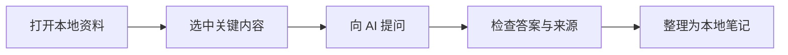

# CoScribe 简明使用指南 / Quick Guide

> CoScribe 把普通文件夹作为项目。你的 Markdown、PDF、DOCX、PPTX、图片和网页资料始终保留在本地文件系统中。

新建项目时，本文件会自动放进项目根目录。它可以正常编辑、移动或删除；应用右上角的“使用指南”按钮始终可以重新打开内置版本。

## 五分钟开始

1. **创建或打开项目**  
   点击“新建项目”，或直接打开一个已有资料文件夹。已有 Markdown 和子文件夹会显示在左侧文件树中。
2. **配置 AI**  
   打开“设置 → AI 服务”，填写服务地址、接口协议、模型和 API Key。第三方兼容站点应填写它实际提供的地址与模型名。
3. **打开资料**  
   CoScribe 支持 Markdown、PDF、DOCX、PPTX、图片、常见文本与代码文件。Markdown 默认使用预览模式。
4. **选择上下文**  
   在聊天输入框上方选择“选中内容”“当前内容”“当前文档”“当前项目”或“模型通用知识”。
5. **保存知识**  
   普通 AI 文件修改会先展示差异；点击“整理笔记”时，AI 可以在项目中选择合适位置并创建 Markdown 文件或目录。

## 推荐工作流



### 阅读和提问

- 在 Markdown、PDF、DOCX、PPTX 或文本中选中文字，再选择“选中内容”。
- 按 `Cmd/Ctrl + Shift + K` 可以把文档选区放入聊天输入框。
- 发送后，上下文会冻结；之后切换文档不会改变已经提交的问题。
- 长对话右侧的浅色刻度可以快速跳到每次请求的开头。

### 整理和创建笔记

- “整理笔记”不会默认追加到当前文档，而是让 AI 根据会话主题和项目结构选择位置。
- AI 可以创建新的 Markdown 文件、子文件夹和多文件笔记结构。
- 普通文件修改需要确认后才写入磁盘；已经接受的多文件操作可以在“AI 操作”中撤销。
- 项目根目录的 `COSCRIBE.md` 用于保存稳定的项目目标、术语、偏好和约束。

## 文档与媒体

| 内容 | 使用方式 |
| --- | --- |
| Markdown | 预览、编辑、双栏、大纲折叠、Mermaid、数学公式和代码高亮 |
| PDF | 连续阅读、目录、搜索、选区、批注、书签和当前页 OCR |
| DOCX | 本地语义预览和全文搜索 |
| PPTX | 本地只读幻灯片预览和逐页搜索 |
| 图片 | 查看、缩放、本地 OCR 或显式 AI 增强 |
| 网页 | 使用内置单标签资料浏览器，保留原网页并可保存 Markdown、PDF 或 MHTML |

### 截图、粘贴图片与 OCR

- 点击聊天工具栏中的“截图”，或按 `Cmd/Ctrl + Shift + 8`，然后拖动鼠标框选区域。
- 可以直接把 PNG、JPEG、WebP 或非动画 GIF 粘贴到聊天输入框。
- 图片点击“本地文字识别”，PDF 点击“本地识别当前页”。
- macOS Apple Silicon 可点击“语音”进行本地中英文实时转写。

### 图片生成

在“设置 → 图片生成”中单独填写 GPT-Image 2 的服务地址和 API Key。生成图片会保存到：

```text
assets/ai-images/
```

随后可以在聊天中要求 AI 把生成图片插入笔记。

## 代码块

代码语言会自动识别和高亮。右上角按钮会把原始代码复制到系统剪贴板：

```typescript
interface LearningNote {
  source: string
  summary: string
}

const note: LearningNote = {
  source: '本地项目',
  summary: '让知识回到自己的文件中'
}
```

## 常用快捷键

| 操作 | macOS | Windows / Linux |
| --- | --- | --- |
| 发送选区到聊天 | `⌘ ⇧ K` | `Ctrl + Shift + K` |
| 框选截图 | `⌘ ⇧ 8` | `Ctrl + Shift + 8` |
| 保存 Markdown | `⌘ S` | `Ctrl + S` |
| 查找 | `⌘ F` | `Ctrl + F` |
| 发送消息 | `Enter` | `Enter` |
| 输入换行 | `Shift + Enter` | `Shift + Enter` |

## 常见配置问题

- `Unexpected token '<'`：服务返回了 HTML 而不是 JSON，请检查最终请求地址、接口协议和 `/v1` 路径。
- `HTTP 401 / Invalid API key`：服务端拒绝当前 API Key，请检查 Key 是否属于这个服务地址。
- 第三方服务未必支持所有模型名或思考强度，以服务端说明为准。
- API Key 保存在系统用户数据目录，不会写入项目或本指南。

---

## English Quick Guide

1. Create a project or open an existing folder.
2. Configure the AI endpoint, protocol, model, and API key under **Settings → AI Service**.
3. Open a local document and choose the exact context scope before sending a request.
4. Use **Organize notes** when you want AI to choose an appropriate project location and create durable Markdown notes.
5. Use the copy button on code blocks, paste images into chat, or press `Cmd/Ctrl + Shift + 8` for a region screenshot.

New projects receive a local copy of this guide. The built-in copy remains available from the **User Guide** button in the upper-right corner.
