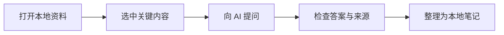

# CoScribe 简明使用指南 / Quick Guide

> CoScribe 把普通文件夹作为项目。你的 Markdown、PDF、DOCX、PPTX、图片和网页资料始终保留在本地文件系统中。

新建项目时，本文件会自动放进项目根目录。它可以正常编辑、移动或删除；应用右上角的“使用指南”按钮始终可以重新打开内置版本。

## 五分钟开始

1. **创建或打开项目**  
   点击“新建项目”，或直接打开一个已有资料文件夹。已有 Markdown 和子文件夹会显示在左侧文件树中。
2. **配置 AI**  
   打开“设置 → AI 服务商”，添加一组或多组 OpenAI-compatible / Anthropic 配置。填写地址和 API Key 后点击“获取模型”，选择并保存该服务商真正提供的模型；右下角只切换已经保存的模型。
3. **打开资料**  
   CoScribe 支持 Markdown、PDF、DOCX、PPTX、图片、常见文本与代码文件。Markdown 默认使用预览模式。
4. **选择上下文**  
   在聊天输入框上方选择“选中内容”“当前内容”“当前文档”“当前项目”或“模型通用知识”。
5. **保存知识**  
   普通 AI 文件修改会先展示差异；点击“整理笔记”时，AI 可以在项目中选择合适位置并创建 Markdown 文件或目录。

## 推荐工作流


```mermaid
flowchart LR
  A[打开本地资料] --> B[选中关键内容]
  B --> C[向 AI 提问]
  C --> D[检查答案与来源]
  D --> E[整理为本地笔记]
```

### 阅读和提问

- 左侧文件、会话、搜索、标注、记忆、AI 操作和插件图标可以重复点击：第一次打开对应侧栏，再次点击当前图标会收起。左侧栏和 AI 侧栏的收起按钮都位于各自面板内。
- 在 Markdown、PDF、DOCX、PPTX 或文本中选中文字，再选择“选中内容”。
- 左侧 `IDE` 只切换中央工作区，右侧 AI 侧栏保持不变。代码文件单击选择、双击打开。
- 按 `Cmd/Ctrl + Shift + K` 可以把文档选区放入聊天输入框。
- 把文件树中的文件或文件夹拖到聊天输入框，会追加其路径而不会立即发送。
- 发送后，上下文会冻结；之后切换文档不会改变已经提交的问题。
- 回答生成期间会显示当前阶段、服务商/模型、正在处理的工具和本次请求已用时间。
- 长对话右侧的浅色刻度可以快速跳到每次请求的开头。
- AI 上下文区域会显示当前请求窗口的预估 token 占用和回答预留空间。超过预算时默认只压缩发送给模型的早期历史，界面中的原始聊天不会删除；也可以点击“压缩早期历史”强制压缩下一次请求。
- 在聊天输入框输入 `/` 可以打开命令菜单。`/compact` 会让 AI 对当前完整逻辑会话生成一份可持续使用的语义摘要；原始聊天仍保留，后续请求使用摘要加上新增消息。按钮“压缩早期历史”仍是只影响下一次请求的轻量压缩。

### 聊天命令

| 命令 | 作用 |
| --- | --- |
| `/compact` | 全量压缩当前会话并持久化摘要，原始记录不删除 |
| `/fork [标题]` | 从当前会话分叉出独立副本 |
| `/resume [标题或 ID]` | 恢复最近或指定会话；不带参数恢复最近的其他会话 |
| `/new [标题]` | 新建空白会话 |
| `/rename <标题>` | 重命名当前会话 |
| `/clear` | 清空当前会话及其压缩、整理检查点 |
| `/note` | 只整理上次整理之后新增的对话内容并保存到项目 |
| `/stop` | 停止当前 AI 请求或图片生成 |
| `/quit` | 收起 AI 侧栏 |
| `/help` | 打开命令帮助 |

命令可以用鼠标点击，也可以用 `↑` / `↓`、`Tab` 和 `Enter` 操作。未知的斜杠文本不会发送给模型。

### OpenAI 与 Anthropic 配置

- **OpenAI 格式**支持 Responses API 与 Chat Completions，也可填写第三方 OpenAI-compatible 地址。
- **Anthropic 格式**使用 Messages API：应用会请求 `/v1/messages`，使用 `x-api-key` 与固定的 `anthropic-version: 2023-06-01`。
- 填好地址和 API Key 后点击“获取模型”。成功结果会保存到当前服务商；修改地址会清除旧列表，右下角不会混入其他服务商的 GPT/Claude 预设。
- 如果第三方 Anthropic 代理提供版本路径或完整 `/messages` 地址，可直接填写；CoScribe 不会把 OpenAI 和 Anthropic 的密钥混用。
- Anthropic 当前思考强度使用 `output_config.effort`。菜单会提供 `low`、`medium`、`high`、`xhigh` 和 `max`；OpenAI 配置仍保留 `ultra`。
- “设置 → AI 行为”可以覆盖上下文窗口和回答预留 token。填写 `0` 会使用 CoScribe 的模型预设。

### 整理和创建笔记

- “整理笔记”不会默认追加到当前文档，而是让 AI 根据会话主题和项目结构选择位置。
- 每次整理成功写入后，CoScribe 会记录本次处理到的最后一条会话消息；再次点击“整理笔记”或执行 `/note` 时，只处理新增内容，不会重复整理已完成部分。只有文件真正写入成功，检查点才会推进。
- 整理过程中会逐步显示筛选会话、读取项目资料、模型生成、校验操作和写入文件等状态；失败或停止不会误标为已整理。
- AI 可以创建新的 Markdown 文件、子文件夹和多文件笔记结构。
- 普通 AI 对话也可以创建或修改项目内代码/文本文件，但与 Markdown 一样必须先展示差异并由用户确认。
- 普通文件修改需要确认后才写入磁盘；已经接受的多文件操作可以在“AI 操作”中撤销。
- 项目根目录的 `COSCRIBE.md` 用于保存稳定的项目目标、术语、偏好和约束。

## 文档与媒体

| 内容 | 使用方式 |
| --- | --- |
| Markdown | 预览、编辑、双栏、大纲折叠、Mermaid、数学公式和代码高亮 |
| PDF | 连续阅读、目录、搜索、选区、批注、书签和当前页 OCR |
| DOCX | 本地语义预览和全文搜索 |
| PPTX | 本地只读幻灯片预览和逐页搜索 |
| 图片 | 查看、缩放、本地 OCR 或显式 AI 增强 |
| 网页 | 使用最多 10 个标签页的内置资料浏览器，保留历史、Cookie 和登录状态；网页选区自动成为聊天候选，并可保存 Markdown、PDF 或 MHTML |
| 代码 | 在 IDE 中编辑和保存；本地关键字/符号列表始终可用；未保存缓冲区可作为冻结的 AI 上下文 |

### IDE、终端与 AI Shell

- IDE 直接使用当前项目文件夹，不创建另一份工程数据。代码编辑器支持 `Cmd/Ctrl + S` 保存，以及独立的代码自动保存开关和间隔。
- 编辑器只在本地即时提供关键字和当前文件符号列表；`Tab` 可接受已打开的本地候选。输入代码时不会自动请求 AI 模型。右侧 AI 仍可提议创建或修改代码文件，但必须先展示预览并由用户确认。
- 底部终端可在项目路径中运行命令；工具栏也可以唤起系统终端。
- 普通终端不会自动授权 AI。AI Shell 默认关闭，需要先在“设置 → AI 行为”启用 AI Shell 功能；此开关只显示开启入口，不会授权 AI 或执行命令。
- 每次点击“开启 AI Shell”都会先显示风险警告，再显示第二次确认。授权只绑定当前项目和当前应用会话；关闭终端、项目或应用会撤销。
- 默认每条 AI 命令仍要单独确认。命令使用当前登录用户权限运行，不受项目文件夹沙箱限制。

### 截图、粘贴图片与 OCR

- 点击聊天工具栏中的“截图”，或按 `Cmd/Ctrl + Shift + D`。桌面保持原样，只显示透明十字取景层；按住鼠标拖出需要的区域并松开确认，`Esc` 取消。截图不会自动识别或预选区域。
- 可以直接把 PNG、JPEG、WebP 或非动画 GIF 粘贴到聊天输入框。
- 图片点击“本地文字识别”，PDF 点击“本地识别当前页”。
- macOS Apple Silicon 可点击“语音”进行本地中英文实时转写。

### 图片生成

在“设置 → 图片生成”中单独填写 GPT-Image 2 的服务地址和 API Key。生成图片会保存到：

```text
assets/ai-images/
```

随后可以在聊天中要求 AI 把生成图片插入笔记。

## 代码块

代码语言会自动识别和高亮。右上角按钮会把原始代码复制到系统剪贴板：

```typescript
interface LearningNote {
  source: string
  summary: string
}

const note: LearningNote = {
  source: '本地项目',
  summary: '让知识回到自己的文件中'
}
```

## 常用快捷键

| 操作 | macOS | Windows / Linux |
| --- | --- | --- |
| 发送选区到聊天 | `⌘ ⇧ K` | `Ctrl + Shift + K` |
| 框选截图 | `⌘ ⇧ D` | `Ctrl + Shift + D` |
| 保存 Markdown | `⌘ S` | `Ctrl + S` |
| 保存代码 | `⌘ S` | `Ctrl + S` |
| 本地代码提示 | `Tab` 接受可见的本地候选，否则缩进 | `Tab` 接受可见的本地候选，否则缩进 |
| 查找 | `⌘ F` | `Ctrl + F` |
| 发送消息 | `Enter` | `Enter` |
| 输入换行 | `Shift + Enter` | `Shift + Enter` |

## 常见配置问题

- `Unexpected token '<'`：服务返回了 HTML 而不是 JSON，请检查最终请求地址、所选提供方、接口协议和 `/v1` 路径。
- `HTTP 401 / Invalid API key`：服务端拒绝当前 API Key，请检查 Key 是否属于这个服务地址。
- 第三方服务未必支持所有模型名或思考强度，以服务端说明为准。
- API Key 保存在系统用户数据目录，不会写入项目或本指南。

---

## English Quick Guide

1. Create a project or open an existing folder.
2. Add one or more named provider profiles under **Settings → AI Providers**. Enter the endpoint and key, select **Fetch Models**, then save only the models that provider actually exposes.
3. Open a local document and choose the exact context scope before sending a request.
4. Use **Organize notes** when you want AI to choose an appropriate project location and create durable Markdown notes.
5. Use the copy button on code blocks, paste images into chat, or press `Cmd/Ctrl + Shift + D` for a manual region screenshot.

The **IDE** rail entry switches only the center workspace and keeps the AI sidebar intact. Code files are selected with one click and opened with a double click. Code autosave has its own toggle and delay. The editor provides local keyword and current-file symbol candidates but does not call an AI model while you type. The right AI sidebar can still propose creating or editing code files through the normal preview-and-confirm flow. The bottom terminal is independent from AI Shell. AI Shell is off by default, requires a risk warning plus a second confirmation every time it is opened, and defaults to per-command approval.

The OpenAI-compatible and Anthropic Messages profiles are stored separately. The lower-right switcher only shows models already fetched and enabled for the selected provider. The research browser keeps up to 10 tabs plus local history and persistent login cookies; selecting webpage text creates a removable chat candidate. The context meter shows estimated input usage and output reserve; request-only compaction never deletes the visible chat history. Re-click any active left rail icon to collapse its panel.

New projects receive a local copy of this guide. The built-in copy remains available from the **User Guide** button in the upper-right corner.
